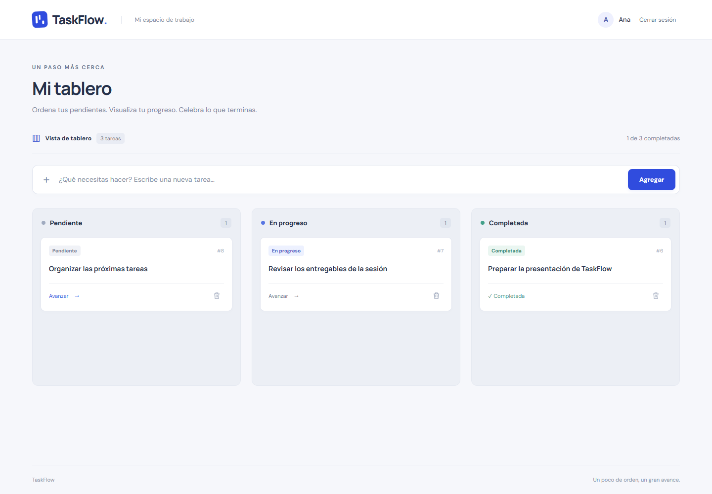

# TaskFlow frontend

## Entrega personal: Tarea 3

Esta rama añade la vista de detalle y edición de tareas en React.

**Enlace de entrega:** https://github.com/EdgarPunina/taskflow-frontend/tree/tarea3-edgar

Desde el tablero, pulsa el título de una tarea para ver su descripción, estado y fecha de creación.
Pulsa **Editar tarea** para cambiar título, descripción y estado; **Guardar cambios** persiste
los datos en Laravel y **Cancelar** vuelve al detalle sin guardar.

Consulta [docs/TAREA-3.md](docs/TAREA-3.md) para las rutas, componentes, pruebas y capturas.

## Proyecto de la sesión 06

Tablero Kanban en React conectado a la API real de Laravel Sanctum de las sesiones 04 y 05. Implementa la práctica de la sesión 06: registro, login, tareas propias, creación, avance de estado, eliminación y ruta privada.

Repositorio del equipo: [EdgarPunina/taskflow-frontend](https://github.com/EdgarPunina/taskflow-frontend) (privado).



## Iniciar la aplicación

Requisitos: Node.js 22.12 o posterior (verificado con 24.16), npm y el backend de TaskFlow con Sanctum y sus migraciones ejecutadas. Para las pruebas de navegador también se necesita Google Chrome.

En una terminal, desde la carpeta hermana `taskflow-backend`:

```powershell
powershell -NoProfile -ExecutionPolicy Bypass -File .\scripts\serve-sqlite.ps1
```

El backend queda en `http://127.0.0.1:8000`, usando la base SQLite de práctica. Si prefieres el MySQL configurado en `.env`, enciende MySQL, ejecuta `php artisan migrate` y luego `php artisan serve`.

En otra terminal, desde `taskflow-frontend`:

```powershell
npm.cmd ci
npm.cmd run dev -- --host 127.0.0.1 --port 5173 --strictPort
```

Abre **http://127.0.0.1:5173**. La raíz redirige a `/login`; el enlace **Crear cuenta** lleva a `/register`. Puedes registrar tu propia cuenta o usar las credenciales de demostración de la sesión 05, guardadas localmente en `taskflow-backend/storage/app/practice-credentials.json`. Esas credenciales no están en el repositorio.

En PowerShell se usa `npm.cmd` para evitar el bloqueo de `npm.ps1` por la política de ejecución. En otras terminales puedes usar `npm` directamente.

## Configuración de la API

`src/services/api.js` usa `http://localhost:8000/api` por defecto. Para apuntar a otra instancia, copia `.env.example` a `.env`, modifica `VITE_API_URL` y reinicia Vite. No incluyas secretos en variables `VITE_*`: se incorporan al frontend.

El interceptor de Axios añade `Accept: application/json` y el token Bearer de `localStorage.taskflow_token` a las peticiones protegidas. Las respuestas de tareas se leen desde `response.data.data`. Un token revocado elimina la sesión local y redirige al login. El cierre de sesión llama a `/logout` antes de borrar el token local.

La configuración CORS existente de Laravel permite estas llamadas entre puertos. La autorización y el aislamiento de datos los aplica Laravel; `PrivateRoute` controla la navegación del frontend.

## Componentes

```text
App (BrowserRouter)
├── /login → Login
├── /register → Register
└── /dashboard → PrivateRoute → Dashboard
                                └── Board (estado y operaciones API)
                                    └── Column (presenta las tareas de un estado)
                                        └── TaskCard (props y callbacks)
```

El estado de tareas vive en `Board`, padre común de las columnas. Cada cambio usa actualizaciones funcionales de estado para conservar las operaciones concurrentes. `Column` y `TaskCard` reciben props; el ID procede siempre de la base de datos. Las peticiones iniciales se cancelan al desmontar el componente. Crear, avanzar y eliminar se reflejan en pantalla después de recibir una respuesta exitosa de Laravel.

Se incluyen validación del formulario, estados de carga, reintento de carga, botones bloqueados durante operaciones, mensajes accesibles, estilos móviles y fuentes servidas desde la propia aplicación.

## Comprobar el proyecto

Con frontend y backend activos:

```powershell
npm.cmd run lint
npm.cmd run build
npm.cmd run test:e2e
```

Las nueve pruebas Playwright utilizan Chrome y la API real. Las cinco pruebas originales verifican rutas, registro, login, persistencia después de recargar, avance hasta completada, eliminación, aislamiento entre dos cuentas, revocación al cerrar sesión, validaciones, token inválido y diseño móvil. Cuatro pruebas adicionales verifican detalle y edición, cancelación, descripción opcional, errores de guardado y protección de las nuevas rutas. Solo se simula la pérdida de red en las pruebas específicas de recuperación; los usuarios, tareas y tokens se crean en Laravel.

Las pruebas crean usuarios de prueba únicos, eliminan sus tareas y revocan sus tokens. No uses una base de producción. Los resultados completos quedan en `test-results/`, excluido de Git; las capturas de evidencia se guardan en `docs/evidencia/`.

`FRONTEND_URL` y `API_URL` permiten apuntar las pruebas a otros servidores. `API_URL` debe coincidir con el backend configurado en `VITE_API_URL`.

## Entrega

Consulta [docs/SESION-06.md](docs/SESION-06.md) para el historial de la práctica del equipo. La vista de detalle y edición de la Tarea 3 se completó en esta rama personal; el despliegue de la sesión 07 corresponde a otra entrega.
