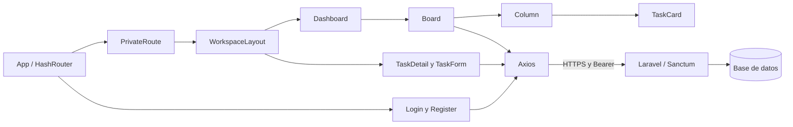

# TaskFlow ? Frontend

Tablero Kanban de Edgar Punina en React conectado a la API real de Laravel. Incluye registro, login, tareas por usuario, creaci?n, avance, eliminaci?n, detalle y edici?n con formularios controlados, useState y Axios.

- Repositorio compartido del equipo: https://github.com/EdgarPunina/taskflow-frontend
- URL prevista de GitHub Pages: https://edgarpunina.github.io/taskflow-frontend/
- API p?blica temporal de la sesi?n 07: https://acquisition-tahoe-sequence-discrimination.trycloudflare.com/api
- Rama de la Tarea 3, conservada: https://github.com/EdgarPunina/taskflow-frontend/tree/tarea3-edgar
- Despliegues: https://github.com/EdgarPunina/taskflow-frontend/actions/workflows/deploy-pages.yml

**Estado de publicaci?n:** c?digo y workflow preparados. GitHub rechaz? habilitar Pages porque el plan actual no lo admite en este repositorio privado. Falta un plan compatible o autorizaci?n del propietario para hacerlo p?blico; la URL prevista todav?a no constituye un despliegue verificado.


## Stack y ejecuci?n local

React 18, React Router 7, Axios y Vite 8. Node.js 22.12 o posterior; el workflow utiliza Node 24. Desde la ra?z del frontend:

```powershell
npm.cmd ci
Copy-Item .env.example .env
npm.cmd run dev -- --host 127.0.0.1 --port 5173 --strictPort
```

Copia .env solo en la primera instalaci?n. VITE_API_URL debe apuntar a la API deseada. Para uso local deja http://localhost:8000/api y arranca el backend con scripts/serve-sqlite.ps1. Abre http://127.0.0.1:5173/#/login y crea una cuenta. No se incluyen contrase?as ni tokens en el repositorio.

## Arquitectura y componentes



- Board administra las tareas con useState y actualizaciones funcionales. Column y TaskCard reciben props y callbacks.
- TaskDetail carga la tarea mediante su ID; TaskForm controla t?tulo, descripci?n y estado y persiste con PATCH. Cancelar conserva los datos originales.
- Axios agrega el token de localStorage.taskflow_token. El cierre de sesi?n revoca el token en Laravel. Ante un 401 se elimina la sesi?n y se conserva la subcarpeta de Pages al redirigir.
- Laravel verifica la propiedad de las tareas. PrivateRoute protege la navegaci?n; la autorizaci?n de datos pertenece al servidor.
- En el backend se aplica Observer (GoF) mediante TaskObserver para registrar cambios de estado; las f?bricas Eloquent generan fixtures. Ver [arquitectura del backend](https://github.com/EdgarPunina/Proyecto-Laravel-inicial-de-TaskFlow/blob/main/docs/ARQUITECTURA.md).

Las rutas son /#/login, /#/register, /#/dashboard, /#/tasks/:id y /#/tasks/:id/edit. HashRouter permite abrirlas directamente y recargar en un servidor est?tico. Vite usa base './' para cargar los recursos desde la subcarpeta del repositorio.

## Estilos de sesi?n 07

src/styles/index.css contiene fuentes locales, variables compartidas, accesibilidad, animaciones fadeIn y reglas adaptables. auth.css, dashboard.css y board.css separan las vistas. El tablero conserva contadores y distintivos por columna, a?ade bordes de tarjeta seg?n el estado y respeta prefers-reduced-motion. El bot?n Cerrar sesi?n funciona tambi?n en detalle y edici?n.

## Compilar y verificar

```powershell
npm.cmd run lint
npm.cmd run build
npm.cmd run preview -- --host 127.0.0.1 --port 4173 --strictPort
```

En otra terminal, con Google Chrome instalado y la API activa:

```powershell
$env:FRONTEND_URL='http://127.0.0.1:4173'
$env:API_URL='https://acquisition-tahoe-sequence-discrimination.trycloudflare.com/api'
npm.cmd run test:e2e
```

API_URL debe coincidir con VITE_API_URL usado al compilar. Nueve pruebas Playwright verifican registro, login, CRUD, persistencia tras F5, aislamiento, logout, errores, detalle, edici?n y m?vil. Para verificar Pages cambia FRONTEND_URL por la URL p?blica. Los tests crean cuentas sint?ticas, limpian tareas y revocan tokens; utiliza una base de pr?ctica.

## Publicar en GitHub Pages

1. En Settings ? Pages, habilita Source: GitHub Actions. El repositorio debe admitir Pages seg?n su plan y visibilidad.
2. En Settings ? Secrets and variables ? Actions ? Variables, configura VITE_API_URL con la URL HTTPS del t?nel terminada en /api. Es una URL p?blica, no un secreto.
3. Un push a main o Run workflow ejecuta deploy-pages.yml: npm ci, lint, validaci?n de URL, build y publicaci?n del artefacto dist.
4. Espera a que build y deploy est?n en verde. Abre la URL p?blica y comprueba registro ? login ? crear ? avanzar ? eliminar ? F5, adem?s de detalle y edici?n.

No se suben dist, node_modules ni .env. Las variables VITE_* se incorporan a los archivos p?blicos; nunca deben contener secretos. Cambiar VITE_API_URL requiere volver a compilar y desplegar.

**El t?nel no es alojamiento permanente.** La API depende del equipo encendido y los procesos Laravel/cloudflared activos. Si reinicias cloudflared, actualiza VITE_API_URL y vuelve a ejecutar Pages antes de la revisi?n del supervisor. El frontend est?tico permanece publicado, pero no puede operar con una API apagada.

## Historial

La sesi?n 06 y la Tarea 3 se integraron en main para la sesi?n 07. La rama personal tarea3-edgar conserva su entrega original. Consulta [sesi?n 06](SESION-06.md) y [Tarea 3](TAREA-3.md) para la evidencia previa.
