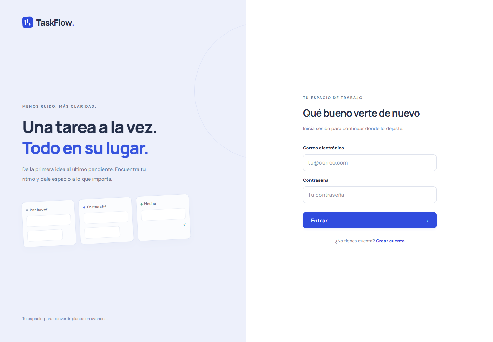
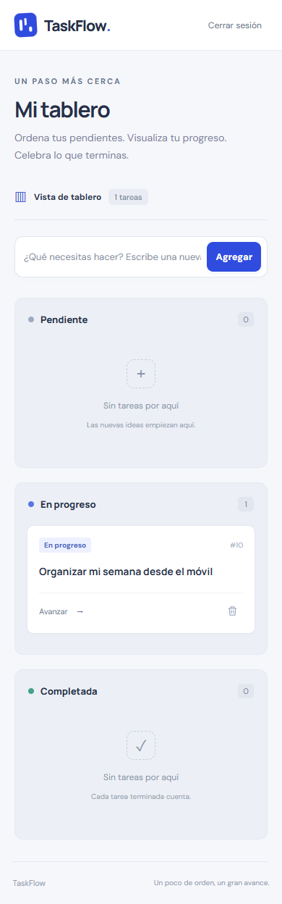

# Práctica de la sesión 06

## Análisis y ejecución del instructivo

Se leyeron las 17 páginas de `instructivo-practica-sesion-06.pdf` y se completó el frontend sobre el backend previamente implementado, sin sustituir los datos por arreglos simulados.

| Paso | Implementación / comprobación |
|---|---|
| 0. Node.js | Ya instalado: Node 24.16.0 y npm 11.13.0. No se reinstaló software global. |
| 1. Vite y plantilla | Proyecto creado con el generador oficial de Vite. Plantilla clonada aparte desde `Patricio-CEDIA/taskflow-frontend`, rama `sesion-06`; se copiaron `src` y `package.json`. |
| 2. Componentes | `Board`, `Column` y `TaskCard` activos, estado elevado a `Board`, tarjetas con `key` e indicadores de estado. |
| 3. Formulario | Input controlado, rechazo de títulos vacíos, máximo de 255 caracteres, envío con Enter y limpieza tras guardar. |
| 4. Rutas | `/login`, `/register` y `/dashboard` con React Router. Raíz y rutas desconocidas redirigen al login. |
| 5. API real | Axios, token Sanctum, registro/login, carga de tareas propias, POST/PATCH/DELETE y persistencia comprobada al recargar. |
| 6. Ruta privada | Sin token se redirige al login. Un token inválido también se elimina tras recibir 401. |
| 7. Git del equipo | Repositorio privado [EdgarPunina/taskflow-frontend](https://github.com/EdgarPunina/taskflow-frontend), separado del backend. Los colaboradores se incorporarán cuando el usuario facilite sus cuentas de GitHub. |

Se mantuvo el contrato HTTP de Laravel sin cambiar el backend. Para evitar las alertas detectadas en las dependencias de la plantilla se actualizó React Router a 7.18.3; se conserva la API declarativa `BrowserRouter`, `Routes`, `Route` y `Navigate`. Vite y su plugin React usan las versiones del generador actual. `package-lock.json` fija el árbol instalado. La instalación final informó cero vulnerabilidades conocidas.

El texto del paso 4 se contradice respecto a la raíz: primero dice que no hay redirección y luego especifica `Route path="*"`. Se implementó y probó esa redirección para que no haya una pantalla en blanco.

## Resultado de las pruebas

Verificación realizada el 11 de septiembre de 2026:

- `npm.cmd run lint`: sin errores ni advertencias.
- `npm.cmd run build`: compilación de producción correcta.
- `npm.cmd run test:e2e`: **5 pruebas aprobadas** con Google Chrome, escritorio de 1440 px y móvil de 390 px.
- Sin errores JavaScript en las pruebas del flujo principal y de rutas.
- La prueba de CRUD verificó F5 después de crear, después de ambos avances y después de eliminar.
- Registro y login reales mediante formularios, comprobación de tareas existentes al volver a iniciar sesión, rechazo de correo duplicado y contraseña incorrecta.
- Segunda cuenta en un contexto de navegador independiente: tablero vacío y 404 al consultar una tarea de la primera cuenta.
- Logout invalidó el token en Laravel; reutilizarlo dio 401.
- Corte de red simulado: carga con opción de reintento y eliminación fallida que conserva la tarjeta.
- Vista móvil sin desbordamiento horizontal y botón Avanzar funcional.

## Evidencia visual

Las capturas se obtuvieron durante las pruebas contra Laravel real. Las tareas mostradas se crearon en la base de práctica y se limpiaron al terminar.

### Login

### Tablero

### Vista móvil

## Trabajo del equipo

Debe existir un solo repositorio frontend para el equipo. Para que los compañeros puedan contribuir faltan sus nombres de usuario de GitHub; no se inventaron destinatarios ni se enviaron invitaciones sin conocerlos. Una vez identificados, el propietario puede agregarlos en **Settings → Collaborators → Add people**. Cada compañero debe aceptar su propia invitación.

El PDF presenta el detalle y la edición de tareas como **Tarea 3**, en una rama `tarea3-<nombre>`, y el despliegue como contenido de la sesión 07. No son pasos de implementación de esta práctica de sesión 06.
