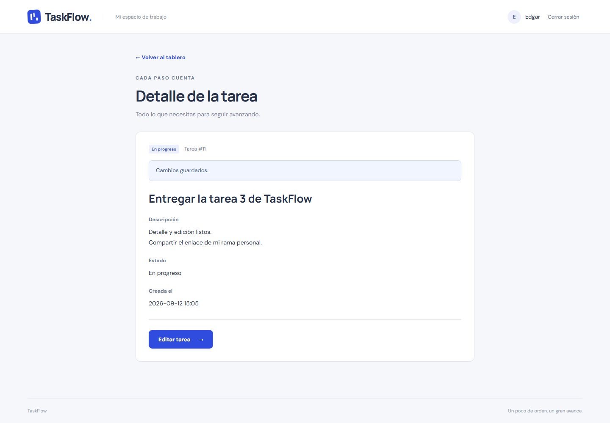
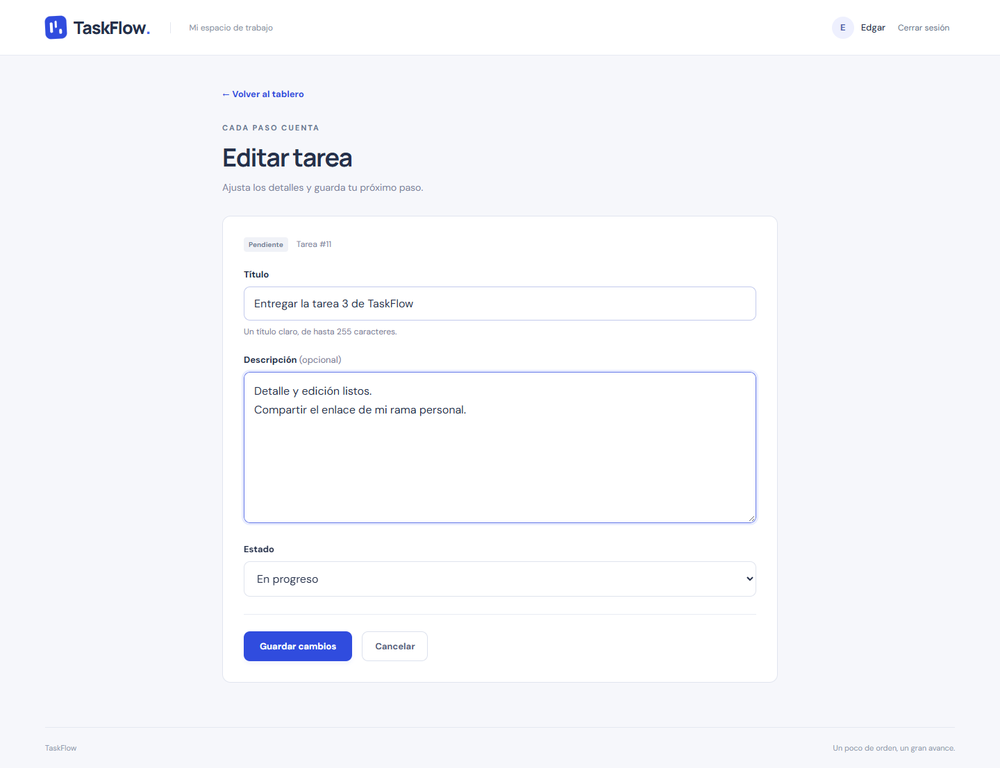
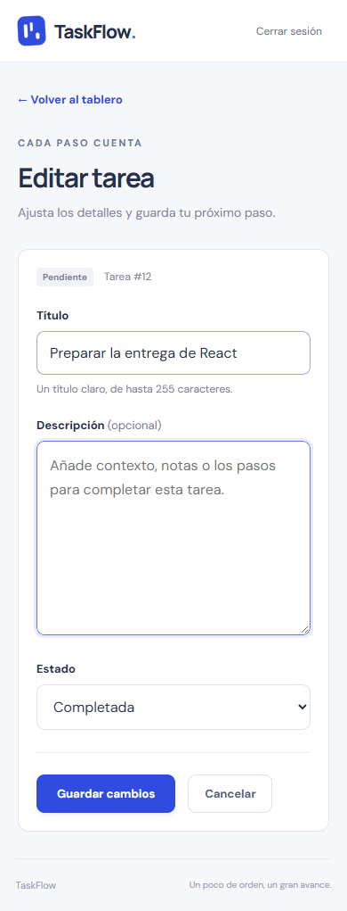

# Tarea 3 — Edgar

**URL para entregar:** https://github.com/EdgarPunina/taskflow-frontend/tree/tarea3-edgar

Rama personal `tarea3-edgar` dentro del repositorio compartido `EdgarPunina/taskflow-frontend`, creada a partir de `origin/main`. El trabajo se entrega en esta rama, sin crear otro repositorio ni fusionarlo con `main`.

## Funcionalidad

- El título de cada tarjeta del tablero enlaza a `/tasks/:id`.
- El detalle consulta `GET /api/tasks/:id` mediante Axios y muestra título, descripción, estado y fecha de creación.
- La ruta `/tasks/:id/edit` carga la tarea y presenta un formulario controlado con `useState` para título, descripción y estado.
- Guardar envía `PATCH /api/tasks/:id`, espera la respuesta de Laravel y vuelve al detalle con confirmación. El propietario no se envía ni se modifica.
- Se valida un título de entre 1 y 255 caracteres. La descripción es opcional: vaciarla guarda `null`. Los estados son `pendiente`, `en_progreso` y `completada`.
- Cancelar vuelve al detalle sin enviar modificaciones.
- Se reutilizan Axios, su interceptor Bearer y `PrivateRoute`. Una tarea ajena o inexistente muestra el mismo estado de tarea no disponible; sin token se redirige al login.
- Se muestran estados de carga, errores de red y una opción de reintento. Un fallo de guardado conserva los valores para volver a intentar. Durante el envío se bloquea el formulario para evitar solicitudes duplicadas.
- El diseño funciona en escritorio y móvil.

## Componentes y hooks

`WorkspaceLayout` reúne la cabecera, perfil, cierre de sesión y pie comunes al tablero y al detalle. `TaskDetail` utiliza `useParams` y `useEffect` para cargar la tarea, con cancelación de la petición al desmontarse. `TaskForm` reutiliza el patrón de formulario controlado y usa `useState`, `useNavigate` y Axios. Al cambiar de ID o de modo detalle/edición se reinicia el componente, evitando mostrar datos del formulario anterior.

El backend de la sesión 05 ya proporciona los endpoints y el aislamiento por usuario; no fue necesario modificarlo.

## Verificación

Con backend y frontend ejecutándose como indica el README:

```powershell
npm.cmd run lint
npm.cmd run build
npm.cmd run test:e2e
```

Resultado del 12 de septiembre de 2026: análisis estático y compilación correctos; **9 pruebas de navegador aprobadas** contra Laravel real, incluidas las 5 originales del tablero.

Las 4 pruebas nuevas de `tests/task-detail.spec.js` verifican:

1. Navegación desde tarjeta, precarga del formulario, modificación de los tres campos, persistencia tras F5 y estado actualizado al volver al tablero.
2. Cancelación sin cambios, borrado de descripción guardado como `null`, cambio a completada y edición móvil sin desbordamiento horizontal.
3. Validación de título vacío, reintento de carga y fallo de guardado que conserva los valores sin modificar la base de datos.
4. Rechazo de tareas ajenas e inexistentes, y protección de detalle y edición sin sesión.

Las pruebas usan cuentas únicas creadas en Laravel y limpian sus tareas y tokens al finalizar. Solo se simula el corte de conexión en el caso específico de recuperación.

## Capturas del navegador






